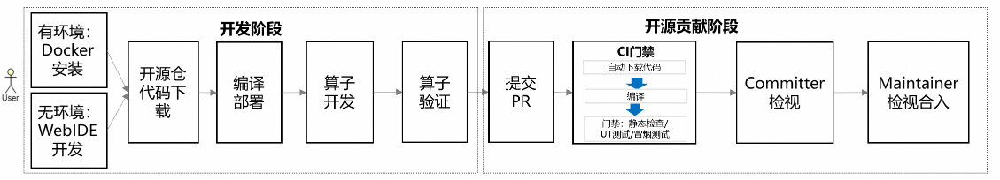

# 快速入门：基于ops-nn仓

本指南旨在帮助您快速上手CANN和`ops-nn`算子仓的使用，最简化地完成环境安装、编译部署及算子运行。算子开发和贡献流程如下图，我们欢迎并鼓励您在社区贡献算子，共同丰富项目生态。




这里将以**AddExample**算子作为实践对象，源文件位于`ops-nn/examples/add_example`目录，请参考下述步骤快速体验起来吧！

## 目录导读
1.  **[环境安装](#一环境安装)**：搭建算子开发和运行环境。
2.  **[编译部署](#二编译部署)**：编译自定义算子包并部署安装，实现快速调用算子。
3.  **[算子开发](#三算子开发)**：通过修改现有算子Kernel，体验开发、编译、验证的完整闭环。
4.  **[算子调试](#四算子调试)**：掌握算子打印和性能采集方法。
5.  **[算子验证](#五算子验证)**：学习如何修改算子example样例，以验证算子在不同输入下的功能正确性。

完成以上步骤，您将对算子开发的全流程有一个基础的实践认知。

## 一、环境安装
### 1. 有环境场景：Docker安装

Docker安装环境以Atlas A2产品（910B）为例。
**前提条件**：
*   **Docker环境**：宿主机已安装Docker引擎（版本1.11.2及以上）。
*   **驱动与固件**：宿主机已安装昇腾NPU的[驱动与固件](https://www.hiascend.com/hardware/firmware-drivers/community?product=1&model=30&cann=8.0.RC3.alpha002&driver=1.0.26.alpha)Ascend HDK 24.1.0版本以上。安装指导详见《[CANN 软件安装指南](https://www.hiascend.com/document/detail/zh/CANNCommunityEdition/850alpha002/softwareinst/instg/instg_0005.html?Mode=PmIns&OS=openEuler&Software=cannToolKit)》。
    
    > **注意**：使用`npu-smi info`查看对应的驱动与固件版本。

#### 下载镜像
拉取已预集成CANN软件包及`ops-nn`所需依赖的镜像。

*   **操作步骤**：
    1.  以root用户登录宿主机。
    2.  执行拉取命令（请根据你的宿主机架构选择）：
        * ARM架构：
        ```bash
        docker pull --platform=arm64 swr.cn-south-1.myhuaweicloud.com/ascendhub/cann:8.5.0-910b-ubuntu22.04-py3.10-ops
        ```
        * X86架构：
        ```bash
        docker pull --platform=amd64 swr.cn-south-1.myhuaweicloud.com/ascendhub/cann:8.5.0-910b-ubuntu22.04-py3.10-ops
        ```
        > **注意**：正常网速下，镜像下载时间约为5-10分钟。

#### Docker运行
请根据以下命令运行docker：

```bash
docker run --name cann_container --device /dev/davinci0 --device /dev/davinci_manager --device /dev/devmm_svm --device /dev/hisi_hdc -v /usr/local/dcmi:/usr/local/dcmi -v /usr/local/bin/npu-smi:/usr/local/bin/npu-smi -v /usr/local/Ascend/driver/lib64/:/usr/local/Ascend/driver/lib64/ -v /usr/local/Ascend/driver/version.info:/usr/local/Ascend/driver/version.info -v /etc/ascend_install.info:/etc/ascend_install.info -it swr.cn-south-1.myhuaweicloud.com/ascendhub/cann:8.5.0-910b-ubuntu22.04-py3.10-ops bash
```
以下为用户需关注的参数说明：
| 参数 | 说明 | 注意事项 |
| :--- | :--- | :--- |
| `--name cann_container` | 为容器指定名称，便于管理。 | 可自定义。 |
| `--device /dev/davinci0` | 核心：将宿主机的NPU设备卡映射到容器内，可指定映射多张NPU设备卡。 | 必须根据实际情况调整：`davinci0`对应系统中的第0张NPU卡。请先在宿主机执行 `npu-smi info`命令，根据输出显示的设备号（如`NPU 0`, `NPU 1`）来修改此编号。|
| `-v /usr/local/Ascend/driver/lib64/:/usr/local/Ascend/driver/lib64/` | 关键挂载：将宿主机的NPU驱动库映射到容器内。 | - |

#### 检查环境
进入容器后，验证环境和驱动是否正常。

-   **检查NPU设备**

    执行如下命令，若返回驱动相关信息说明已成功挂载。    
    ```bash    
    npu-smi info
    ```
-   **检查CANN安装**
    
    执行如下命令查看CANN Toolkit版本信息，是否为8.5.0版本。
    ```bash
    cat /usr/local/Ascend/ascend-toolkit/latest/opp/version.info
    ```

你已经拥有了一个“开箱即用”的算子开发环境。接下来，需要在这个环境里验证从源码到可运行算子的完整工具链。

### 2. 无环境场景：WebIDE开发（内测中）
对于无环境的用户，提供WebIDE开发平台，即“**算子一站式开发平台**”。该平台为您提供在线可直接运行的昇腾环境，环境中已安装必备的软件包，无需手动安装。

> **前提说明：**
> 当前平台功能正在内测中，若您想体验，请先单击[LINK](https://gitcode.com/org/cann/discussions/47)申请云开发平台资源，并获取平台介绍文档。只有成功申请了平台资源，开源项目的首页才会有“**云开发**”按钮，您才可以参考下述步骤体验。

1. 进入ops-nn开源项目，单击“`云开发 > WebIDE for Ascend`”进入算子一站式开发平台，根据页面提示启动云开发环境。

   

2. 检查环境是否完备。

    打开`云平台终端`窗口，默认在`/mnt/workspace`目录下，执行如下命令验证环境和驱动是否正常。

    -   **检查NPU设备**：
    
        执行如下命令，若返回驱动相关信息说明已成功挂载。    
        
        ```bash    
        npu-smi info
        ```
    
    -   **检查CANN安装**：
        执行如下命令查看CANN Toolkit版本信息，是否为8.5.0版本。
        
        ```bash
        cat /home/developer/Ascend/ascend-toolkit/latest/opp/version.info
        ```

## 二、编译部署

本阶段目的是**快速体验项目标准流程**，验证环境能否成功进行算子源码编译、打包、安装和运行。

### 1. 获取项目源码

1. 获取项目源码，命令如下：

    ```bash
    git clone https://gitcode.com/cann/ops-nn.git
    ```
    若出现“`fatal: destionation path 'ops-nn' already exists and is not an empty directory.`”说明项目源码已存在，如需刷新项目代码可使用`git pull`命令。

2. 进入项目根目录，命令如下，请区分Docker和WebIDE场景。
    - Docker场景：
      ```bash
      cd ops-nn
      ```
    - WebIDE场景：
      ```bash
      cd /mnt/workspace/ops-nn
      ```

### 2. 编译AddExample算子

进入项目根目录，编译指定算子，通用编译命令格式：`bash build.sh --pkg --soc=<芯片版本> --ops=<算子名>`。

以AddExample算子为例，编译命令如下：

```bash
bash build.sh --pkg --soc=ascend910b --ops=add_example -j16
```

若提示如下信息，说明编译成功。
```bash
Self-extractable archive "cann-ops-nn-custom-linux.${arch}.run" successfully created.
```
编译成功后，run包存放于项目根目录的build_out目录下。

### 3. 安装AddExample算子包
```bash
./build_out/cann-ops-nn-*linux*.run
```
`AddExample`安装在`${ASCEND_HOME_PATH}/opp/vendors`路径中，`${ASCEND_HOME_PATH}`表示CANN软件安装目录。

### 4. 配置环境变量

将自定义算子包的路径加入环境变量，确保运行时能够找到。
```bash
export LD_LIBRARY_PATH=${ASCEND_HOME_PATH}/opp/vendors/custom_nn/op_api/lib:${LD_LIBRARY_PATH}
```

### 5. 快速验证：运行算子样例

通用的运行命令格式：`bash build.sh --run_example <算子名> <运行模式> <包模式>`。

以AddExample为例，其提供了简单算子样例`add_example/examples/test_aclnn_add_example.cpp`，运行该样例验证算子功能是否正常。

```bash
bash build.sh --run_example add_example eager cust --vendor_name=custom
```
预期输出：打印算子`AddExample`的加法计算结果，表明算子已成功部署并正确执行。

```
add_example first input[0] is: 1.000000, second input[0] is: 1.000000, result[0] is: 2.000000
add_example first input[1] is: 1.000000, second input[1] is: 1.000000, result[1] is: 2.000000
add_example first input[2] is: 1.000000, second input[2] is: 1.000000, result[2] is: 2.000000
add_example first input[3] is: 1.000000, second input[3] is: 1.000000, result[3] is: 2.000000
add_example first input[4] is: 1.000000, second input[4] is: 1.000000, result[4] is: 2.000000
add_example first input[5] is: 1.000000, second input[5] is: 1.000000, result[5] is: 2.000000
add_example first input[6] is: 1.000000, second input[6] is: 1.000000, result[6] is: 2.000000
add_example first input[7] is: 1.000000, second input[7] is: 1.000000, result[7] is: 2.000000
...
```

## 三、算子开发

本阶段目的是对已成功运行的AddExample算子尝试**修改核函数代码**。

### 1. 修改Kernel实现
找到AddExample算子的核心kernel实现文件`ops-nn/examples/add_example/op_kernel/add_example.h`，尝试将算子中的Add操作改为Mul操作：

```cpp
__aicore__ inline void AddExample<T>::Compute(int32_t progress)
{
    AscendC::LocalTensor<T> xLocal = inputQueueX.DeQue<T>();
    AscendC::LocalTensor<T> yLocal = inputQueueY.DeQue<T>();
    AscendC::LocalTensor<T> zLocal = outputQueueZ.AllocTensor<T>();
    // === 在此处将Add替换为Mul ===
    // AscendC::Add(zLocal, xLocal, yLocal, tileLength_);
    AscendC::Mul(zLocal, xLocal, yLocal, tileLength_);
    outputQueueZ.EnQue<T>(zLocal);
    inputQueueX.FreeTensor(xLocal);
    inputQueueY.FreeTensor(yLocal);
}
```
### 2. 编译与验证

重复[编译部署](#二编译部署)章节中的第2至第5步：
1. **重新编译**：
    先回到项目根目录，编译命令如下：
    ```bash
    bash build.sh --pkg --soc=ascend910b --ops=add_example -j16
    ```

2. **重新安装**：
    ```bash
    ./build_out/cann-ops-nn-*linux*.run
    ```
    
3. **重新验证**：
    ```bash
    bash build.sh --run_example add_example eager cust --vendor_name=custom
    ```

4. **成功标志**：输出结果变成乘法结果。
    ```
    add_example first input[0] is: 1.000000, second input[0] is: 1.000000, result[0] is: 1.000000
    add_example first input[1] is: 1.000000, second input[1] is: 1.000000, result[1] is: 1.000000
    add_example first input[2] is: 1.000000, second input[2] is: 1.000000, result[2] is: 1.000000
    add_example first input[3] is: 1.000000, second input[3] is: 1.000000, result[3] is: 1.000000
    add_example first input[4] is: 1.000000, second input[4] is: 1.000000, result[4] is: 1.000000
    add_example first input[5] is: 1.000000, second input[5] is: 1.000000, result[5] is: 1.000000
    add_example first input[6] is: 1.000000, second input[6] is: 1.000000, result[6] is: 1.000000
    add_example first input[7] is: 1.000000, second input[7] is: 1.000000, result[7] is: 1.000000
    ...
    ```

## 四、算子调试
本阶段以AddExample为例，在算子中添加打印并采集算子性能数据，以便后续问题分析定位。

### 1. 打印
算子如果出现执行失败、精度异常等问题，添加打印进行问题分析和定位。

请在`examples/add_example/op_kernel/add_example.h`中进行代码修改。

* **printf**

  该接口支持打印Scalar类型数据，如整数、字符型、布尔型等，详细介绍请参见[《Ascend C API》](https://hiascend.com/document/redirect/CannCommunityAscendCApi)中“算子调测API > printf”。
  
  ```c++
  blockLength_ = (tilingData->totalLength + AscendC::GetBlockNum() - 1) / AscendC::GetBlockNum();
  tileNum_ = tilingData->tileNum;
  tileLength_ = ((blockLength_ + tileNum_ - 1) / tileNum_ / BUFFER_NUM) ?
        ((blockLength_ + tileNum_ - 1) / tileNum_ / BUFFER_NUM) : 1;
  // 打印当前核计算Block长度
  AscendC::PRINTF("Tiling blockLength is %llu\n", blockLength_);
  ```
* **DumpTensor**

  该接口支持Dump指定Tensor的内容，同时支持打印自定义附加信息，比如当前行号等，详细介绍请参见[《Ascend C API》](https://hiascend.com/document/redirect/CannCommunityAscendCApi)中“算子调测API > DumpTensor”。
  
  ```c++
  AscendC::LocalTensor<T> zLocal = outputQueueZ.DeQue<T>();
  // 打印zLocal Tensor信息
  DumpTensor(zLocal, 0, 128);
  ```
### 2. 性能采集

当算子功能验证正确后，可通过`msprof`工具采集算子性能数据。

-  **生成可执行文件**
   
    调用AddExample算子的example样例，生成可执行文件（test_aclnn_add_example），该文件位于项目`ops-nn/build`目录。
    ```bash
    bash build.sh --run_example add_example eager cust --vendor_name=custom
    ```

-  **采集性能数据**

    进入AddExample算子可执行文件目录`ops-nn/build/`，执行如下命令：

    ```bash
    msprof --application="./test_aclnn_add_example"
    ```
采集结果在项目`ops-nn/build/`目录，msprof命令执行完后会自动解析并导出性能数据结果文件，详细内容请参见[msprof](https://www.hiascend.com/document/detail/zh/mindstudio/82RC1/T&ITools/Profiling/atlasprofiling_16_0110.html#ZH-CN_TOPIC_0000002504160251)。

## 五、算子验证

本阶段通过修改AddExample算子example样例中的输入数据，验证该算子在多种场景下的功能正确性。

### 1. 修改测试输入
找到并编辑`AddExample`的`ops-nn/examples/add_example/examples/test_aclnn_add_example.cpp`，修改输入张量的形状和数值。

**修改输入/输出数据**：修改输入、输出的shape信息，以及初始化数据，构造相应的输入、输出tensor。

```c++
int main() {
    // ... 初始化代码 ...
    
    // === ① 修改selfX的输入 ===
    // 修改前：shape = {32, 4, 4, 4}, 数值全为1
    // 修改后：将输入shape改为 {8, 8, 8, 8}，并填充不同的测试数据
    std::vector<int64_t> selfXShape = {8, 8, 8, 8};
    std::vector<float> selfXHostData(4096); // 4096 = 8 * 8 * 8 *8
    // 可使用循环填充更有区分度的数据，例如递增序列
    for (int i = 0; i < 4096; ++i) {
        selfXHostData[i] = static_cast<float>(i % 10); // 填充0-9的循环值
    }
    // === ② 参考selfX，同理修改selfY、selfZ的输入 ===
    
    // ... 后续执行代码 ...
}
```
### 2. 重新编译并验证

1. 由于只修改了example测试代码，无需重新编译算子包。

2. 重新执行验证命令：

    ```bash
    bash build.sh --run_example add_example eager cust --vendor_name=custom
    ```

3. 观察算子输出结果是否符合预期。

## 六、开发贡献

体验完上述操作，基本完成了一个算子开发，您可以将算子贡献到本项目`experimental`目录，贡献流程请参考[贡献指南](CONTRIBUTING.md)。过程中，任何问题可通过Issue方式咨询。

如果您想要**深入了解**上述每个环节，请参考如下指南：

- [环境部署](./docs/zh/context/quick_install.md)：提供不同场景环境搭建指导，包括Docker安装、手动安装CANN软件包等。
- [编译部署及算子调用](./docs/zh/invocation/quick_op_invocation.md)：提供不同场景和方式的算子包编译和验证指导，深入了解编译参数与调用方式。
- [算子开发](./docs/zh/develop/aicore_develop_guide.md)：提供算子开发指南，学习从零创建算子工程、实现Tiling和Kernel。
- [调试调优](./docs/zh/debug/op_debug_prof.md)：提供更系统的调试技巧与性能优化方法。
