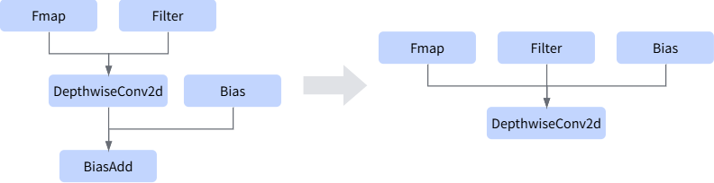
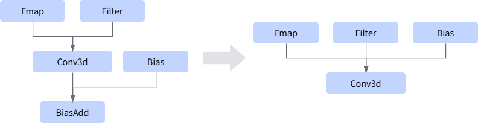
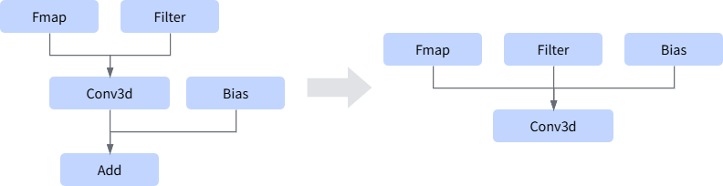

# AABiasaddConvFusion

## 融合模式

该融合规则将不包含Bias的Conv卷积算子和BiasAdd算子融合成一个包含Bias输入的Conv卷积算子，提高计算性能。

### 融合模式一

### 融合模式二

### 融合模式三

### 融合模式四

### 融合模式五

### 融合模式六

### 融合模式七

## 使用约束

- 卷积算子的输出节点个数必须为1。
- 卷积算子的输入数据边个数必须大于等于1。
- 当卷积算子已经有Bias的时候，不支持融合。
- 不支持bias shape为未知（动态shape）的场景。bias shape支持1D（维度值等于卷积输出通道数C）或4D（至少4个维度值为1）的reshape场景。

## 支持的型号

<!-- npu="310p" id1 -->
Atlas推理系列产品
<!-- end id1 -->

<!-- npu="310b" id2 -->
Atlas 200I/500 A2推理产品
<!-- end id2 -->

<!-- npu="910" id3 -->
Atlas训练系列产品
<!-- end id3 -->

<!-- npu="910b" id4 -->
Atlas A2系列产品
<!-- end id4 -->

<!-- npu="950" id5 -->
Ascend 950PR&950DT系列产品
<!-- end id5 -->
