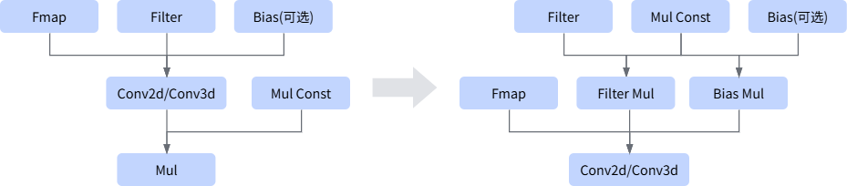

# AConv2dMulFusion

## 融合模式

该融合将Conv2d+Mul或Conv3d+Mul融合为一个融合算子Conv。

## 使用约束

- Conv节点可以是Conv2d或Conv3d。
- Conv节点的输出节点个数必须为1，且该输出节点为Mul；Mul节点的两路输入都必须有数据边。
- Mul节点必须为1路Const输入+1路非Const输入。
- Filter、Bias和Mul的另一路，三个输入均为Const时，支持融合。
- 当Conv节点是Conv2d时：
    - 卷积输出格式只支持NCHW或NHWC。
    - scale输入shape必须为1维，且维度值为1（标量）或等于卷积输出通道数C。
    <!-- npu="950" id8 -->
    - 当输出为NCHW格式时，不支持channel-wise（维度值等于C）的scale。该约束适用于如下产品型号：
        <!-- npu="950" id6 -->
        - Ascend 950PR&950DT系列产品
        <!-- end id6 -->
    <!-- end id8 -->
- 当Conv节点是Conv3d时：
    - 仅支持data输入的format为NDHWC格式。
    - Mul节点的Const Mul输入必须为1维输入，且该维度必须等于Conv3d算子输出的C维度。
    - Mul节点的输出节点个数必须为1。
    - scale节点的输入shape不能是动态shape。

## 支持的型号

<!-- npu="310p" id1 -->
Atlas推理系列产品
<!-- end id1 -->

<!-- npu="310b" id2 -->
Atlas 200I/500 A2推理产品
<!-- end id2 -->

<!-- npu="910" id3 -->
Atlas训练系列产品
<!-- end id3 -->

<!-- npu="910b" id4 -->
Atlas A2系列产品
<!-- end id4 -->

<!-- npu="A3" id5 -->
Atlas A3系列产品
<!-- end id5 -->

<!-- npu="950" id7 -->
Ascend 950PR&950DT系列产品
<!-- end id7 -->
