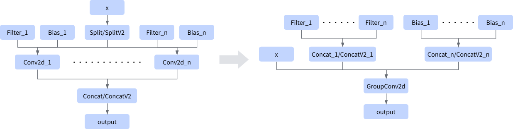

# ASplitConv2dConcatPass

## 融合模式

该融合规则将Split/SplitV2+Conv2d \*N+Concat/ConcatV2融合成一个组卷积（GroupConv2d），简化图结构。

## 使用约束

- 每个Conv2d的输入个数必须相同，且大于等于2个。
- 每个Conv2d的filter的shape和format要相同（只支持HWCN或NCHW）。
- 每个Conv2d只能单输出，且输出节点必须为同一个Concat/ConcatV2节点。
- Conv2d的filter和bias必须是类型{"AscendWeightQuant", "Const", "Constant", "QuantBiasOptimization", "QuantBiasRollBack", "QuantWeightRollBack"}中的一个。
- Split/SplitV2节点的dim输入和Concat/ConcatV2节点的concat_dim输入必须是const类型，且Split/SplitV2节点的输出个数和Concat/ConcatV2的输入个数必须相同。
- Split/SplitV2节点的切分轴和Concat/ConcatV2节点的组合轴必须都为channel方向；split轴与concat轴的值必须相等，当轴值为-1时仅支持NHWC格式。
- Split数据输入、Concat输出、Conv2d输入的格式必须一致。
- Split的每个输出分支只能有一个节点，且该节点必须是Conv2d。
- Conv2d的filter和bias输入数据类型只支持：float、float16、int8和int32。

## 支持的型号

<!-- npu="310p" id1 -->
Atlas推理系列产品
<!-- end id1 -->

<!-- npu="310b" id2 -->
Atlas 200I/500 A2推理产品
<!-- end id2 -->

<!-- npu="910" id3 -->
Atlas训练系列产品
<!-- end id3 -->

<!-- npu="950" id4 -->
Ascend 950PR&950DT系列产品
<!-- end id4 -->
