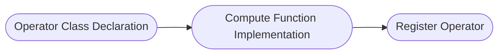

# AI CPU Operator Development Guide

## Overview

> Note:
>
> 1. For basic concepts and AI CPU interfaces involved in operator development, refer to [TBE & AI CPU Operator Development](https://www.hiascend.com/document/detail/en/CANNCommunityEdition/latest/others/tbeaicpudevg/atlasopdev_10_0001.html) for detailed information.
> 2. AI CPU operators are developed using the C++ language and run on the AI CPU hardware unit.
> 3. build.sh: The commands involved in operator development can be viewed through `bash build.sh --help`. For function parameter descriptions, refer to [build Parameter Description](../context/build.md).

This development guide uses the `AddExample` operator as an example to introduce the new operator development process and the deliverables involved. For complete sample code, visit the project `examples` directory.

1. [Project Creation](#project-creation): Before developing an operator, complete the environment deployment and create the operator directory for subsequent operator compilation and deployment.

2. [Operator Definition](#operator-definition): Determine the operator functionality and prototype definition.

3. [Kernel Implementation](#kernel-implementation): Implement the Device-side operator kernel function.

4. [aclnn Adaptation](#aclnn-adaptation): Custom operators are recommended to use the aclnn interface for invocation, which requires completing binary publishing in advance. **If you use graph mode to invoke the operator**, refer to the [Graph Mode Adaptation Guide](./graph_develop_guide.md).

5. [Compilation and Deployment](#compilation-and-deployment): Complete the compilation and installation of the custom operator through the project compilation script.

6. [Operator Verification](#operator-verification): Verify the custom operator functionality through common operator invocation methods.

## Project Creation

**1. Environment Deployment**

Before developing an operator, complete the basic environment setup by following [Environment Deployment](../context/quick_install.md).

**2. Directory Creation**

Directory creation is an important step in operator development, providing a unified directory structure and file organization for subsequent code writing, compilation, and debugging.

You can quickly create the operator directory through `build.sh`. Enter the project root directory and execute the following command:

```bash
# Create the specified operator directory, for example: bash build.sh --genop=activation/op_example
# ${op_class} represents the operator type, such as the activation class.
# ${op_name} represents the lowercase underscore form of the operator name. For example, the `AddExample` operator corresponds to add_example. New operators must not have the same name as existing operators.
bash build.sh --genop_aicpu=${op_class}/${op_name}
```

After the command executes successfully, the following message appears:

```bash
Create the AI CPU initial directory for ${op_name} under ${op_class} success
```

After creation, the directory structure is as follows:

```text
${op_name}                              # Replace with the lowercase underscore form of the actual operator name
├── examples                            # Operator invocation samples
│   └── test_aclnn_${op_name}.cpp       # Operator aclnn invocation sample
├── op_host                             # Host-side implementation
│   └── ${op_name}_infershape.cpp       # InferShape implementation, implementing operator shape inference, inferring the output shape at runtime
├── op_kernel_aicpu                     # Device-side Kernel implementation
│   ├── ${op_name}_aicpu.cpp            # Kernel entry file, containing the main function and scheduling logic
│   ├── ${op_name}_aicpu.h              # Kernel header file, including function declarations, structure definitions, and logic implementation
│   └── ${op_name}.json                 # Operator information library, defining basic operator information such as name, input/output, and data types
├── tests                               # UT implementation
│   └── ut                              # Kernel/aclnn UT implementation
└── CMakeLists.txt                      # Operator Cmakelist entry
```

If `${op_class}` is a new operator category, you need to additionally add `${op_class}` to the `OP_CATEGORY_LIST` in `cmake/variables.cmake`; otherwise, normal compilation is not possible.

## Operator Definition

Operator definition requires two deliverables: `README.md` and `${op_name}.json`

**Deliverable 1: README.md**

Before developing an operator, determine the functionality and computation logic of the target operator.

For an example of the custom `AddExample` operator, refer to [AddExample Operator Description](../../../examples/add_example_aicpu/README.md).

**Deliverable 2: ${op_name}.json**

Operator information library.

For an example of the custom `AddExample` operator, refer to [AddExample Operator Information Library](../../../examples/add_example_aicpu/op_kernel_aicpu/add_example.json).

## Kernel Implementation

### Kernel Introduction

Kernel is the core part of an operator executed on the NPU. The Kernel implementation includes the following steps:



### Code Implementation

Kernel requires two deliverables: `${op_name}_aicpu.cpp` and `${op_name}_aicpu.h`

**Deliverable 1: ${op_name}_aicpu.h**

Operator class declaration

The first step of Kernel implementation is to declare the operator class in the header file `op_kernel_aicpu/${op_name}_aicpu.h`. The operator class must inherit from the CpuKernel base class.
For detailed implementation, refer to [add_example_aicpu.h](../../../examples/add_example_aicpu/op_kernel_aicpu/add_example_aicpu.h).

```CPP
// 1. Operator class declaration
// Include the AI CPU base library header file
#include "cpu_kernel.h"
// Define the namespace aicpu (fixed, do not modify), and define the operator Compute implementation function
namespace aicpu {
// The operator class inherits from the CpuKernel base class
class AddExampleCpuKernel : public CpuKernel {
 public:
  ~AddExampleCpuKernel() = default;
  // Declare the Compute function (needs to be overridden); the parameter CpuKernelContext is the context of CPUKernel, including operator input, output, and attribute information
  uint32_t Compute(CpuKernelContext &ctx) override;
};
}  // namespace aicpu
```

**Deliverable 2: ${op_name}_aicpu.cpp**

Compute function implementation and AI CPU operator registration

Obtain the input/output Tensor information and perform validity checks, then implement the core computation logic (such as the addition operation), and set the computation result to the output Tensor.

For detailed implementation, refer to [add_example_aicpu.cpp](../../../examples/add_example_aicpu/op_kernel_aicpu/add_example_aicpu.cpp).

```C++
// 2. Compute function implementation
#include "add_example_aicpu.h"

namespace {
// Operator name
const char* const kAddExample = "AddExample";
const uint32_t kParamInvalid = 1;
}  // namespace

// Define the namespace aicpu
namespace aicpu {
// Implement the Compute function of the custom operator class
uint32_t AddExampleCpuKernel::Compute(CpuKernelContext& ctx) {
  // Obtain the input tensor from CpuKernelContext
  Tensor* input0 = ctx.Input(0);
  Tensor* input1 = ctx.Input(1);
  // Obtain the output tensor from CpuKernelContext
  Tensor* output = ctx.Output(0);

  // Perform basic validation on the tensor; check for null pointers
  if (input0 == nullptr || input1 == nullptr || output == nullptr) {
    return kParamInvalid;
  }

  // Obtain the data type of the input tensor
  auto data_type = static_cast<DataType>(input0->GetDataType());
  // Obtain the data address of the input tensor, for example, the input data type is int32
  auto input0_data = reinterpret_cast<int32_t*>(input0->GetData());
  // Obtain the tensor shape
  auto input0_shape = input->GetTensorShape();

  // Obtain the data address of the output tensor, for example, the output data type is int32
  auto y = reinterpret_cast<int32_t*>(output->GetData());

  // The AddCompute function executes the corresponding computation based on the input type.
  // Since C++ does not natively support half-precision floating-point types, you can use the third-party library Eigen (version 3.3.9 recommended) for representation.
  switch (data_type) {
    case DT_FLOAT:
      return AddCompute<float>(...);
    case DT_INT32:
      return AddCompute<int32>(...);
      ....
    default : return PARAM_INVALID;
  }
}

// 3. Register the operator Kernel implementation for the framework to obtain the Compute function of the operator Kernel.
REGISTER_CPU_KERNEL(kAddExample, AddExampleCpuKernel);
}  // namespace aicpu
```

## aclnn Adaptation

After operator development and compilation are completed, the aclnn interface (a set of C-based APIs) is automatically generated. No additional configuration is required. You can directly invoke the aclnn interface in your application to call the operator.

## Compilation and Deployment

After operator development is completed, compile the operator project to generate a custom operator installation package *.run. The specific operations are as follows:

1. **Preparation.**

    Complete the basic environment setup by following [Project Creation](#project-creation), and check whether the operator development deliverables are complete and in the corresponding operator category directory.

2. **Compile the custom operator package.**

    Using the `AddExample` operator as an example, assuming the development deliverables are in the `examples` directory, the complete code is in the [add_example](../../../examples/add_example_aicpu) directory.

    ```bash
    # Compile the specified operator, for example: bash build.sh --pkg --ops=add_example
    bash build.sh --pkg --soc=${soc_version} --vendor_name=${vendor_name} --ops=${op_list} [--experimental]
    ```

   - --soc: ${soc_version} represents the NPU model. For Atlas A2 series products, use "ascend910b" (default). For Atlas A3 series products, use "ascend910_93". For Ascend 950PR/Ascend 950DT products, use "ascend950".
   - --vendor_name (optional): ${vendor_name} represents the name of the custom operator package to build. The default name is custom.
   - --ops (optional): ${op_list} represents the operators to compile. If not specified, all operators are compiled by default. The format is "--ops=add_example".
   - --experimental (optional): If the operator being compiled is a contributed operator, configure --experimental.

    If the following message appears, the compilation is successful:

    ```bash
    Self-extractable archive "cann-ops-nn-${vendor_name}-linux.${arch}.run" successfully created.
    ```

3. **Install the custom operator package.**

    ```bash
    # Install the run package
    ./build_out/cann-ops-nn-${vendor_name}-linux.${arch}.run
    ```

    The custom operator package is installed in the `${ASCEND_HOME_PATH}/opp/vendors` path. `${ASCEND_HOME_PATH}` represents the CANN software installation directory, which can be configured in the environment variable in advance.

4. **(Optional) Uninstall the custom operator package.**

    After the custom operator package is installed, an `uninstall.sh` script is generated in the `${ASCEND_HOME_PATH}/opp/vendors/${vendor_name}_nn/scripts` directory. You can uninstall the custom operator package through this script. The command is as follows:

    ```bash
    bash ${ASCEND_HOME_PATH}/opp/vendors/${vendor_name}_nn/scripts/uninstall.sh
    ```

## Operator Verification

Before verifying the operator, ensure that the environment variables are configured. The command is as follows:

```bash
export LD_LIBRARY_PATH=${ASCEND_HOME_PATH}/opp/vendors/${vendor_name}_nn/op_api/lib:${LD_LIBRARY_PATH}
```

- **UT Verification**

  During operator development, you can quickly verify through UT verification (such as Kernel).

- **aclnn Invocation Verification**

  After the developed operator is compiled and deployed, you can verify the functionality through the aclnn method. For the method, refer to [Operator Invocation Methods](../invocation/op_invocation.md).
