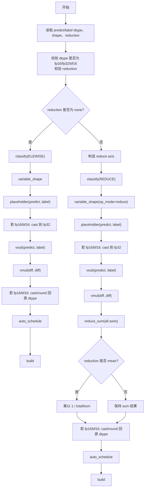
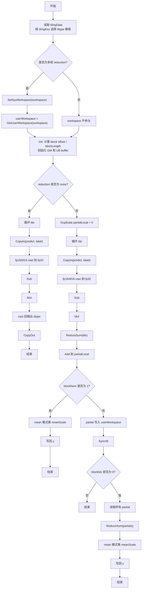

# MseLoss 算子设计文档

## 一、需求背景

### 1.1 需求来源

通过 CANN 训练营 2026 暑期季社区任务完成 `MseLoss` 算子 Ascend C 实现，并向昇腾开源算子仓贡献。任务要求参考昇腾 CANN 内置 `aclnnMseLoss` / TBE 算子语义，在 Atlas A2 训练系列产品和 Atlas A3 系列产品上实现功能一致、精度达标、性能不低于 TBE 版本的 Ascend C 自定义算子。

### 1.2 背景介绍

#### 1.2.1 MseLoss 算子实现优化

`MseLoss` 用于计算预测值 `predict` 与目标值 `label` 的均方误差，支持 `none`、`sum`、`mean` 三种 reduction 模式：

$$
loss_i = (predict_i - label_i)^2
$$

$$
y =
\begin{cases}
loss_i, & reduction = \mathrm{none} \\
\sum_{i=0}^{N-1} loss_i, & reduction = \mathrm{sum} \\
\frac{1}{N}\sum_{i=0}^{N-1} loss_i, & reduction = \mathrm{mean}
\end{cases}
$$

本任务基于历史 TBE 版本功能，使用 Ascend C 重新实现 `MseLoss`，并针对小 shape、非 32B 对齐 tail、多核 reduction workspace 等场景进行优化。

TBE 算子源码、原型和算子信息库路径如下：

| 类型 | 路径 |
| --- | --- |
| TBE 实现源码 | `${ASCEND_INSTALL_PATH}/opp/built-in/op_impl/ai_core/tbe/impl/ops_legacy/dynamic/mse_loss.py` |
| 算子原型 | `${ASCEND_INSTALL_PATH}/opp/built-in/op_proto/inc/nn_norm_ops.h` 中 `REG_OP(MseLoss)` |
| 算子信息库 | `${ASCEND_INSTALL_PATH}/opp/built-in/op_impl/ai_core/tbe/config/ascend910b/aic-ascend910b-ops-info-legacy.json` 中 `MseLoss` |
| kernel 信息库 | `${ASCEND_INSTALL_PATH}/opp/built-in/op_impl/ai_core/tbe/kernel/config/ascend910b/ops_legacy/mse_loss.json` |

说明：`${ASCEND_INSTALL_PATH}` 表示 CANN 安装目录。CANN 9.0 环境还包含 `MSELossV2` 的内置 Ascend C 实现，路径为 `${ASCEND_INSTALL_PATH}/opp/built-in/op_impl/ai_core/tbe/impl/ops_nn/ascendc/mse_loss_v2/`。本任务接口和任务书对齐 `MseLoss` / `aclnnMseLoss`，因此需求对齐以 `ops_legacy/dynamic/mse_loss.py`、`nn_norm_ops.h` 和 legacy 信息库为准；`MSELossV2` 仅作为 Ascend C reduction 实现参考。

#### 1.2.2 MseLoss 算子现状分析

##### 1.2.2.1 TBE 算子支持的数据类型和数据格式

根据 `nn_norm_ops.h` 和 `aic-ascend910b-ops-info-legacy.json`，TBE `MseLoss` 支持能力如下：

| 参数 | 类型 | dtype | format | shape | 说明 |
| --- | --- | --- | --- | --- | --- |
| predict | 输入 | float16 / float32 / bfloat16 | ND | all | 预测值 |
| label | 输入 | float16 / float32 / bfloat16 | ND | all | 目标值 |
| reduction | 属性 | string | - | - | 可选，默认 `mean`，支持 `none` / `sum` / `mean` |
| y | 输出 | float16 / float32 / bfloat16 | ND | all | 输出结果 |

信息库中 `MseLoss` 标记支持：

- `dynamicShapeSupport=true`
- `dynamicRankSupport=true`
- `dynamicCompileStatic=true`
- `softsync=true`
- `precision_reduce=false`

##### 1.2.2.2 TBE 算子实现描述

TBE 源码 `mse_loss.py` 主要包含 `mse_loss_compute` 和 `mse_loss` 两层逻辑。

`mse_loss` 入口逻辑：

1. 获取 `predict`、`label` 的 dtype。
2. 将 `predict["rel_pos_to_reduce"]` 和 `label["rel_pos_to_reduce"]` 设置为 `"before"`。
3. 检查 dtype 必须属于 `("bfloat16", "float16", "float32")`。
4. 检查 `kernel_name`。
5. 检查 `reduction` 必须属于 `("mean", "sum", "none")`。
6. 将 `reduction` 写入 compile info。
7. 若 `reduction != "none"`：
   - 构造 reduce axis；
   - 使用 `classify(..., OpPatternMode.REDUCE, extra_params)` 进入 reduce 调度模式；
   - 使用 `shape_util.variable_shape(..., op_mode="reduce")` 获取动态 shape；
   - 创建 `data_predict`、`data_label` placeholder；
   - 调用 `mse_loss_compute` 生成计算图；
   - 使用 `tbe.auto_schedule` 生成 schedule。
8. 若 `reduction == "none"`：
   - 使用 `classify(..., OpPatternMode.ELEWISE)` 进入逐元素调度模式；
   - 使用 `shape_util.variable_shape` 获取动态 shape；
   - 创建 placeholder；
   - 调用 `mse_loss_compute` 生成逐元素计算图；
   - 使用 `tbe.auto_schedule` 生成 schedule。
9. 调用 `tbe.build(schedules, config)` 编译。

`mse_loss_compute` 计算逻辑：

1. 获取原始 dtype `ori_dtype`。
2. 若输入为 `float16` 或 `bfloat16`：
   - `predict` cast 到 `float32`；
   - `label` cast 到 `float32`；
   - 中间计算 dtype 设为 `float32`。
3. 计算差值：

$$
res = predict - label
$$

4. 计算平方误差：

$$
result = res^2
$$

5. 若 `reduction == "mean"`：
   - 根据 shape 计算元素总数 `reduce_elts`；
   - 计算系数 `cof = 1 / reduce_elts`；
   - 空 shape 时系数为 NaN；
   - 动态场景通过 compile info 记录 `reduce_mean_cof_dtype`。
6. 若 `reduction != "none"`：
   - 对所有 reduce axis 执行 `reduce_sum(result, keepdims=False)`；
   - 若为 `mean`，再执行 `vmuls(result, cof)`。
7. 若中间 dtype 与原始 dtype 不一致：
   - float16 输出通过 `cast_to(result, "float16")`；
   - bfloat16 输出通过 `round(result, "bfloat16")`。
8. 返回结果 tensor。

##### 1.2.2.3 TBE 算子实现流程图



## 二、需求分析

### 2.1 外部组件依赖

不涉及额外外部组件依赖。算子依赖 CANN 提供的 aclnn 框架、算子注册框架、Ascend C 编译工具链和运行时。

### 2.2 内部适配模块

本任务适配以下内部模块：

- op proto：注册 `MseLoss` 输入、输出、属性和 dtype 支持；
- infer shape：推导 `none` / `sum` / `mean` 对应输出 shape；
- host tiling：完成 shape 校验、dtype 校验、分核、UB 切分、workspace 计算和 tiling key 设置；
- op api：提供 `aclnnMseLossGetWorkspaceSize` 和 `aclnnMseLoss` 调用入口；
- Ascend C kernel：实现 `none`、`sum`、`mean` 三种计算路径；

### 2.3 需求模块设计

#### 2.3.1 Ascend C 算子原型

| 名称 | 类别 | dtype | format | shape | 说明 |
| --- | --- | --- | --- | --- | --- |
| predict | 输入 | fp16 / fp32 / bf16 | ND | all | 预测值 |
| label | 输入 | fp16 / fp32 / bf16 | ND | 与 predict 相同 | 目标值 |
| reduction | 属性 | string | - | - | `none` / `sum` / `mean`，默认 `mean` |
| y | 输出 | fp16 / fp32 / bf16 | ND | `none` 同输入；`sum` / `mean` 为单元素 | 输出 loss |

#### 2.3.2 Ascend C 算子相关约束

与 TBE 算子相比，当前 Ascend C 实现对齐主要功能，约束如下：

- 支持 dtype：`float16`、`float32`、`bfloat16`；
- 支持 format：`ND`；
- `predict`、`label`、`y` dtype 必须一致；
- `predict` 与 `label` shape 必须一致；
- `none` 模式下 `y` shape 必须与输入一致；
- `sum` / `mean` 模式下 `y` 为单元素；
- `reduction` 仅支持 `none`、`sum`、`mean`；
- 不支持输入广播；
- 不支持除 ND 外的其他 format。

## 三、需求详细设计

### 3.1 使能方式

根据实际开发任务，使用 ACLNN 框架调用算子。

### 3.2 需求总体设计

#### 3.2.1 host 侧设计

##### 3.2.1.1 分核策略

host 侧将输入按一维连续向量处理，元素总数为：

$$
totalNum = \prod_{d \in predict.shape} d
$$

`none` 模式为逐元素计算，优先使用多核并行：

$$
\begin{aligned}
rawBlockFactor &= \left\lceil \frac{totalNum}{coreNum} \right\rceil \\
blockFactor &= align\_up(rawBlockFactor, gmAlignElem) \\
blockNum &= \left\lceil \frac{totalNum}{blockFactor} \right\rceil
\end{aligned}
$$

其中 GM 起始地址需满足 32B 对齐：

$$
gmAlignElem =
\begin{cases}
16, & dtype \in \{float16, bfloat16\} \\
8, & dtype = float32
\end{cases}
$$

`sum` / `mean` 模式为全量 reduction。小/中小 shape 如果走多核，会额外引入 `SyncAll()`、workspace partial 写回和 0 号核二次汇总。为降低延迟并减少 workspace 边界风险，host 侧按 UB 预算计算动态单核阈值：

$$
singleCoreThreshold = CalcUbFactor(ubSize, dtype, INT64\_MAX)
$$

当满足：

$$
reduction \ne \mathrm{none} \land totalNum \le singleCoreThreshold
$$

使用单核 fast path：

$$
blockNum = 1,\quad blockFactor = totalNum,\quad workspace = 0
$$

超过该阈值时，进入多核 fallback，仍按 GM 32B 对齐切分，并启用 `SetScheduleMode(1)`。

##### 3.2.1.2 数据分块和内存优化策略

UB 中需要为以下对象分配空间：

- `predictQueue`：输入 predict，双缓冲；
- `labelQueue`：输入 label，双缓冲；
- `outputQueue`：输出 y，双缓冲；
- `predictFloatBuf`：fp16/bf16 转 fp32 临时 buffer；
- `labelFloatBuf`：fp16/bf16 转 fp32 临时 buffer；
- `tmpFloatBuf`：差值、平方误差和 reduce 临时 buffer；
- `partialFloatBuf`：每核 partial sum；
- `downloadQueue`：多核 partial 汇总下载 buffer。

host 侧预留固定 UB 空间后，根据 dtype 估算每元素 UB 消耗：

$$
availableUb = ubSize - reservedUb
$$

fp32 路径每元素按输入、输出和 fp32 临时 buffer 估算：

$$
bytesPerElem(float32) = 7 \times sizeof(float)
$$

fp16 / bf16 路径需要 IO buffer 和 fp32 计算 buffer：

$$
bytesPerElem(float16/bfloat16) = 3 \times 2 \times sizeof(ioType) + 3 \times sizeof(float)
$$

最终：

$$
\begin{aligned}
rawUbFactor &= \left\lfloor \frac{availableUb}{bytesPerElem} \right\rfloor \\
ubFactor &= floor\_align(rawUbFactor, 64) \\
ubFactor &= \min(ubFactor, 64 \times 255)
\end{aligned}
$$

当 `totalNum < ubFactor` 时，`ubFactor` 向上按 64 元素对齐，避免过小 tile 引入额外循环。

多核 `sum` / `mean` 需要 workspace：

$$
workspace = 16MB + blockNum \times 8 \times sizeof(float)
$$

其中：

- 16MB 为 Ascend C `SyncAll()` 系统 workspace；
- `blockNum * 8 * sizeof(float)` 为每核 32B partial sum 用户 workspace；
- 单核 fast path 和 `none` 模式 workspace 为 0。

##### 3.2.1.3 tilingKey 规划策略

根据输入 dtype 设置 tiling key：

| tilingKey | dtype | kernel 模板 |
| --- | --- | --- |
| 0 | float16 | `MseLoss<half>` |
| 1 | float32 | `MseLoss<float>` |
| 2 | bfloat16 | `MseLoss<bfloat16_t>` |

`reduction`、`blockNum`、`blockFactor`、`ubFactor`、`meanScale` 通过 tiling data 传入 kernel，不额外拆分 tiling key。

#### 3.2.2 kernel 侧设计

##### 3.2.2.1 kernel 侧实现描述

kernel 入口根据 tiling key 分发到不同 dtype 模板。多核 `sum` / `mean` 路径先设置系统 workspace：

```cpp
AscendC::SetSysWorkspace(workspace);
userWorkspace = AscendC::GetUserWorkspace(workspace);
```

随后进入 `Init` 和 `Process`。

`Init` 阶段：

1. 读取 tiling data。
2. 根据 `GetBlockIdx()` 计算当前核处理的 `blockLength` 和 GM 偏移。
3. 初始化 `predictGM`、`labelGM`、`outputGM`、`workspaceGM`。
4. 初始化输入输出队列和计算 buffer。
5. fp16/bf16 分配 fp32 中间 buffer。

`none` 模式：

1. `CopyIn` 搬入 predict 和 label。
2. fp16/bf16 cast 到 fp32。
3. 执行 `Sub` 得到差值。
4. 执行 `Mul` 得到平方误差。
5. fp16/bf16 cast 回原 dtype。
6. `CopyOut` 写回输出。

`sum` / `mean` 单核 fast path：

1. 按 tile 搬入 predict 和 label。
2. fp16/bf16 cast 到 fp32。
3. 执行 `Sub`、`Mul`。
4. 对当前 tile 执行 `ReduceSum`。
5. 将 tile sum 累加到 `partialLocal`。
6. 所有 tile 完成后，`mean` 模式乘以 `1 / totalNum`。
7. 写回最终单元素输出。

`sum` / `mean` 多核 fallback：

1. 每个核独立计算本核 partial sum。
2. 每核将 8 个 fp32 写入用户 workspace，保证 32B 对齐。
3. 执行 `SyncAll()`。
4. 0 号核读取所有 partial。
5. 执行二次 `ReduceSum`。
6. `mean` 模式乘以 `1 / totalNum`。
7. 写回最终单元素输出。

尾块处理：

- 对齐块和非对齐尾块均使用 `DataCopyPad` 搬运，由接口处理尾块边界。

##### 3.2.2.2 Ascend C 实现流程图



##### 3.2.2.3 Ascend C 实现流程图与 TBE 流程图存在的差异点和原因

| 差异点 | TBE 实现 | Ascend C 实现 | 原因 |
| --- | --- | --- | --- |
| 调度方式 | 通过 `classify` 区分 element-wise / reduce，`auto_schedule` 自动生成调度 | host 侧显式计算 `blockNum`、`blockFactor`、`ubFactor`，kernel 显式循环 tile | Ascend C 需要手工控制分核、UB 和数据搬运 |
| dtype 分发 | TBE 根据 placeholder dtype 和 DSL 自动生成 | tilingKey 0/1/2 分发 fp16/fp32/bf16 模板 | Ascend C 需要静态模板实例匹配 kernel |
| fp16/bf16 计算 | TBE 中 fp16/bf16 cast 到 fp32 后计算，再 cast/round 回原 dtype | Ascend C 中 fp16/bf16 同样 cast 到 fp32 计算，再 cast 回原 dtype | 与 TBE 精度逻辑保持一致 |
| reduction 实现 | `tbe.reduce_sum` + `tbe.vmuls`，由 schedule 决定多核实现 | 单核 fast path 或多核 partial workspace + `SyncAll()` + 0 号核二次 reduce | Ascend C 需要显式实现跨核 reduction |
| 小 shape 策略 | TBE 自动 schedule | Ascend C 按 UB 预算走单核 fast path | 小 shape 多核同步开销高，单核实测更快且规避 workspace 边界 |
| workspace | TBE 由编译/调度体系管理 | 多核 reduction 显式申请 16MB 系统 workspace 和用户 partial workspace | `SyncAll()` 需要系统 workspace，partial 汇总需要用户 workspace |
| 尾块搬运 | TBE DSL 自动处理边界 | Ascend C 使用 `DataCopyPad` 处理非对齐尾块 | 保证尾块完整搬运并避免越界 |

### 3.3 支持硬件

与任务书要求保持一致：

| 支持的芯片版本 | 涉及勾选 |
| --- | --- |
| Atlas A2 训练系列产品 | √ |
| Atlas A3 系列产品 | √ |

### 3.4 算子约束限制

- 不支持广播；
- 仅支持 `float16`、`float32`、`bfloat16`；
- 仅支持 `ND` format；
- `predict` 与 `label` shape 必须一致；
- `predict`、`label`、`y` dtype 必须一致；
- `reduction` 仅支持 `none`、`sum`、`mean`；
- `none` 模式输出 shape 与输入一致；
- `sum` / `mean` 模式输出为单元素。

## 四、特性交叉分析

`MseLoss` 为 loss 类基础算子，不涉及可选输入、TensorList、通信、量化、稀疏、融合子图等复杂交叉特性。

需要关注的交叉点如下：

- aclnn 直调需通过算子原型、infer shape 和 tiling 校验；
- A2 / A3 平台 UB 大小和 AIV 核数不同，host tiling 需动态获取平台信息；
- fp16 / bf16 输入需使用 fp32 中间结果计算，保证精度不低于 TBE；
- 多核 reduction 涉及 `SetScheduleMode(1)`、`SetSysWorkspace`、`GetUserWorkspace` 和 `SyncAll()`，需要保证 workspace 大小和地址边界正确。

## 五、可维可测分析

### 5.1 精度标准 / 性能标准

| 验收标准 | 描述 | 标准来源 |
| --- | --- | --- |
| 精度标准 | 输出精度不低于 TBE 版本，满足 CANN Judge 默认精度阈值 | 任务书 / CANN Judge |
| 性能标准 | 所有核参与计算场景性能不低于 TBE 版本 95%；小 shape 若 10us 以下相差 3us 内，需提供分析结论 | 任务书 |

测试覆盖：

- dtype：float16、float32、bfloat16；
- reduction：none、sum、mean；
- shape：小 shape、非 32B 对齐 shape、大 shape、多维 shape；
- 路径：单核 fast path、多核 fallback；
- 特殊输入：正负混合、NaN、Inf；
- 平台：Atlas A2 / Atlas A3 构建与运行。

### 5.2 兼容性分析

本算子为 Ascend C 新实现，对齐内置 TBE `MseLoss` 的核心功能和 aclnn 调用方式。兼容性体现在：

- 输入输出 dtype 与 TBE 信息库一致；
- `none` / `sum` / `mean` 语义与 TBE 源码一致；
- fp16/bf16 内部提升到 fp32 计算的精度策略与 TBE 一致；
- aclnn 直调通过算子注册与信息库适配。

当前缺失能力为广播和非 ND format，这些能力不在本任务实现范围内。
