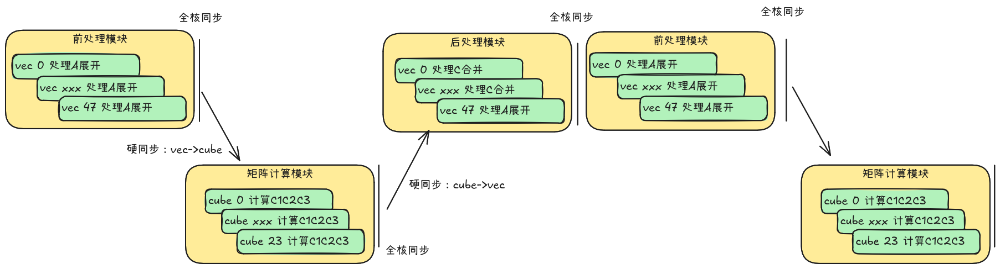
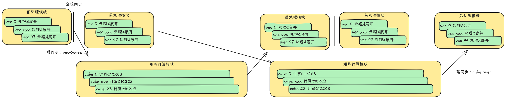

# WeightQuantBatchMatmulExperiment算子

##  概述
本样例的WeightQuantBatchMatmulExperiment算子实现使用自定义算子工程，其kernel包含两个模板：基础模板以及计算解耦流水模板。example的用例分别使用两个模板的精度均正常，示例通过msprof工具采集了模板的性能数据。

##  支持的AI处理器
| 产品 | 是否支持 |
| ---- | :----:|
|Atlas A3 训练系列产品/Atlas A3 推理系列产品|√|
|Atlas A2 训练系列产品/Atlas A2 推理系列产品|√|

## 目录结构介绍
```
├── weight_quant_batch_matmul_experiment
│   ├── examples           // 样例工程
│   ├── op_host            // tiling && 算子定义
│   └── op_kernel          // 算子kernel实现
```

## 功能说明

- 算子功能：
本样例算子实现的是MatMul伪量化A16W4 PerGroup场景，并使用MSD算法完成伪量化的计算过程。其数学表达式为：
1. 计算$A_{max}$:

$$A_{max} = rowMax(|A_{group}|)$$

2. 计算$tmp_{1}$:

$$tmp_{1} = \frac{7.49 * A_{group}}{A_{max}}$$

3. 计算$A_1$:

$$A_1 = round(tmp_{1})$$

4. 计算$tmp_{2}$:

$$tmp_{2}=(tmp_{1}-A_{1})*14.98$$

5. 计算$A_{2}$:

$$A_{2}=round(tmp_{2})$$

6. 计算$tmp_{3}$:

$$tmp_{3}=(tmp_{2}-A_{2})*14.98$$

7. 计算$A_{3}$:

$$A_{3}=round(tmp_{3})$$

8. 构造矩阵$A_{int}$:

$$
A_{int} =
    \begin{bmatrix}
    A_{1} \\
    A_{2} \\
    A_{3} \\
    \end{bmatrix}
$$

9. 计算$C_{int}$:

$$Y_{int} =     \begin{bmatrix}
    Y_{1} \\
    Y_{2} \\
    Y_{3} \\
    \end{bmatrix} = A_{int} Weight_{group}$$

10. 计算$C_{group}$:

$$Y_{group} = [(\frac{Y_{1}}{7.49}+\frac{Y_{2}}{7.49*14.98}+\frac{Y_{3}}{7.49*14.98*14.98})*A_{max}] * scale_{group}$$

11. 计算$Y^i$:

$$Y^{i} = Y_{group} + Y^{i-1}$$

- 算子规格：
  <table>
  <tr><td rowspan="1" align="center">算子类型(OpType)</td><td colspan="4" align="center">WeightQuantBatchMatmul</td></tr>
  </tr>
  <tr><td rowspan="4" align="center">算子输入</td><td align="center">name</td><td align="center">shape</td><td align="center">data type</td><td align="center">format</td></tr>
  <tr><td align="center">x1</td><td align="center">M * K</td><td align="center">float16</td><td align="center">ND</td></tr>
  <tr><td align="center">x2</td><td align="center">K * N</td><td align="center">int4</td><td align="center">ND</td></tr>
  <tr><td align="center">antiquant_scale</td><td align="center"> GroupNum * N </td><td align="center">float16</td><td align="center">ND</td></tr>
  </tr>
  </tr>
  <tr><td rowspan="1" align="center">算子输出</td><td align="center">y</td><td align="center">M * N</td><td align="center">float16</td><td align="center">ND</td></tr>
  </tr>
  <tr><td rowspan="1" align="center">核函数名</td><td colspan="4" align="center">WeightQuantBatchMatmulExperiment</td></tr>
  </table>

## 编译运行
- 配置环境变量
根据当前环境上CANN开发套件包（toolkit包+ops包）的安装方式，选择对应配置环境变量的命令。  
  - 默认路径，root用户安装CANN软件包
    ```bash
    export ASCEND_INSTALL_PATH=/usr/local/Ascend/cann
    ```
  - 默认路径，非root用户安装CANN软件包
    ```bash
    export ASCEND_INSTALL_PATH=$HOME/Ascend/cann
    ```
  - 指定路径install_path，安装CANN软件包
    ```bash
    export ASCEND_INSTALL_PATH=${install_path}/cann
    ```

- 编译与安装自定义算子包
```bash
# 切换到工程根目录
cd ${git_clone_path}  
# 编译样例算子run包
bash build.sh --pkg  --soc=ascend910b --vendor_name=custom --ops=weight_quant_batch_matmul_experiment --experimental 
#安装自定义算子run包
./build_out/cann-ops-nn-${vendor_name}-${arch}_linux.run
```


- 编译+执行aclnn接口样例，采集样例性能：
```bash
# 切换weight_quant_batch_matmul_experiment aclnn执行用例目录
cd ${git_clone_path}/experimental/matmul/weight_quant_batch_matmul_experiment/examples
# 编译+执行aclnn接口+采集性能数据
bash run.sh
# 切换aclnn用例性能数据目录
cd ${git_clone_path}/experimental/matmul/weight_quant_batch_matmul_experiment/examples/output/msprof_result
```

## 流水设计
### 基础流水模板
该模板实现如下流水:

在前处理模块中，多个核产生后处理模块依赖的$A_{max}$和矩阵计算模块依赖的$A_{int}$。在矩阵计算模块中产生后处理模块依赖的$C_{int}$。因此这些模块执行结束后都需要执行一次全核同步，保证下个模块处理的时候上一个模块已完全使用完数据，避免数据踩踏。

### Preload流水模板
该模板实现如下流水:

前处理计算单元可以连续执行两轮，实现当前轮的矩阵计算模板处理和上一轮的后处理模块、下一轮的前处理模块实现并行计算的效果。

## 性能分析
preload流水模板通过流水优化，可以在相同的计算逻辑下实现显著的性能提升，基于Atlas A2进行测试，可以得到如下数据：
  <table>
  <tr><td rowspan="1" align="center">模板类型</td><td colspan="4" align="center">基础流水模板(us)</td><td colspan="4" align="center">preload流水模板(us)</td></tr>
  <tr><td rowspan="1" align="center">算子耗时</td><td colspan="4" align="center">396</td><td colspan="4" align="center">303</td></tr>
  </table>