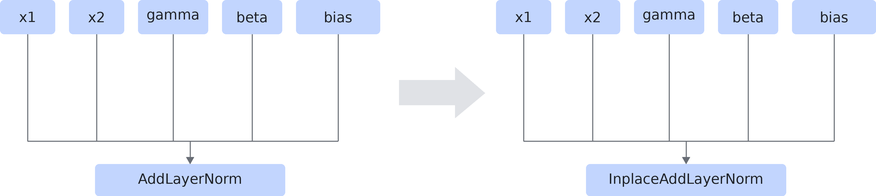

# InplaceAddLayerNormFusionPass

## 融合模式

<!-- npu="950,A3,910b" id1 -->
融合模式一：将图中的AddLayerNorm算子替换为InplaceAddLayerNorm算子，使层归一化结果和加法结果分别原地写回x1和x2。如下图所示。

该融合模式支持的产品如下。

<!-- npu="910b" id2 -->
Atlas A2 训练系列产品/Atlas A2 推理系列产品
<!-- end id2 -->

<!-- npu="A3" id3 -->
Atlas A3 训练系列产品/Atlas A3 推理系列产品
<!-- end id3 -->

<!-- npu="950" id4 -->
Ascend 950PR/Ascend 950DT
<!-- end id4 -->

<!-- end id1 -->

## 使用约束

- 只支持推理场景。
- AddLayerNorm算子的bias为可选输入，支持带bias和不带bias的场景。
- x1和x2必须满足原地写回安全要求：除当前AddLayerNorm算子外不能被其他节点消费，且不能来自连续内存排布的多输出节点。
- 静态shape场景下，x1占用的内存大小必须大于等于L2缓存容量的1/8，且小于等于L2缓存容量的2倍。
- 动态shape场景下，x1的最后一维必须为5120。
- AddLayerNorm算子的x1、x2和gamma输入的数据类型必须相同。
