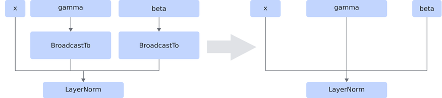

# LayerNormRemoveBroadcastFusionPass

## 融合模式

<!-- npu="950" id1 -->
融合模式一：Ascend 950PR/Ascend 950DT场景下，将LayerNorm算子gamma和beta输入前的BroadcastTo从图中删除，将gamma和beta直接作为LayerNorm算子的输入，并将begin_norm_axis和begin_params_axis统一设置为归一化维度的起始轴。如下图所示。

<!-- end id1 -->

## 使用约束

- 只支持LayerNorm算子的gamma和beta输入前均为BroadcastTo，且两个BroadcastTo的shape输入相同的场景。
- 只支持输入x、gamma和beta均为静态shape的场景。
- gamma和beta不支持标量，二者的shape和数据类型必须相同。
- gamma的维数不能大于x的维数，且gamma的shape必须与x从归一化轴开始的后缀shape相同。
- LayerNorm算子的begin_norm_axis换算为非负轴后，必须指向归一化维度的起始轴。
